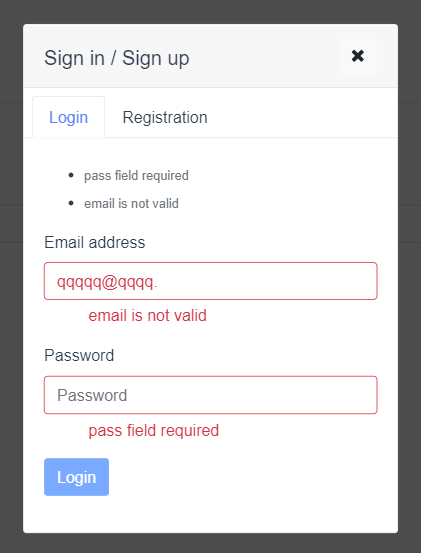

# vue-m-validator
vue-m-validator

Data Validation Library, for VueJs. Perhaps useful for other libraries/frameworks and other projects, but i created this library and using with VueJs with reactive data.



## Installation
```Commandline
npm install --save vue-m-validator
```

## Use case
[example with components](https://github.com/Silksofthesoul/vue-m-validator/tree/master/example)
* Required the library to your project
```Javascript
import validator from 'vue-m-validator';
```

* Make library is reactive
```Javascript
data () {
    return {
      isFirstRun: true,
      username: '',
      email: '',
      password: '',
      password2: '',
      validator: validator
    };
}
```

* If you use many forms on page in a different components, write the hook
```Javascript
  created () {
    validator.reset();
  }
```

* And validate a form
```Javascript
validator
    .addRule(RULE_1)
    .addRule(RULE_2)
    .addRule(RULE_N);
```
for the 'addRule' method, you should use as an argument the object that should have the following look:
```Javascript
validator
    .addRule({
      expression: !USERNAME || USERNAME === ' ',
      name: 'username',
      msg: 'username field required'
  });
```

* In a templates you should use `v-model` for data and validate form data with functions
```HTML
<input
    type="text"
    v-model="username"
    @blur="checkUsername(username)">
<button
    @click="register">Registration</button>
```

* For showing all validation errors you can access the library object property 'errors'
```HTML
<ul class="form-group">
    <li
        v-for="error in validator.errors">
          <small
              class="form-text text-muted"
              v-for="msg in error.msgs">
                  {{msg}}
          </small>
    </li>
</ul>
```

* To display one group message, use method 'getErrors(name)'
```HTML
<ul v-if="isUsernameErrors">
    <li
        class="form-text text-danger"
        v-for="error in validator.getErrors('username')">
            &nbsp;{{ error }}
    </li>
</ul>
```
